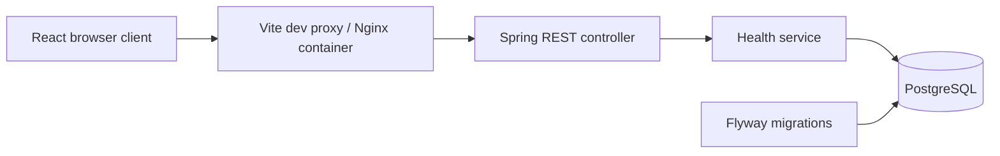
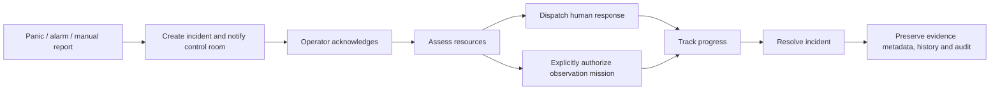

# SkySentinel Security

**See sooner. Respond smarter.**

A centralized Security Operations Centre platform for private security companies.
SkySentinel brings alerts, protected sites, human response and optional,
human-authorized drone observation into one operational view.

Guards and patrol officers often know where an alarm originated without knowing
what is happening there. The project's goal is to improve coordination and
situational awareness while keeping operators responsible for decisions.

## Current status

**Phase 1 foundation only.** Implemented: Spring Boot health API, PostgreSQL
connection and Flyway baseline, React dashboard preview with live backend health, Docker configuration,
and automated foundation tests. Authentication, tenants and operational features
are not implemented. This is a local development configuration, not a production
security platform. See [verification record](docs/phase-1.md).

The existing project description is preserved in [project-brief.md](docs/project-brief.md).
The [approved dashboard screenshot](docs/design/approved-dashboard.png) is the
visual source of truth for Phase 8. At your request, the frontend now brings forward the approved dashboard layout as
a demo preview. It includes selectable incidents, an illustrative map, detail tabs,
fleet/team panels and a camera placeholder. Only backend health uses the real API;
operational actions remain disabled until their tested backend phases.

## Architecture and stack



Java 21, Spring Boot 3.5.16, Maven, Spring Web, Spring Data JPA, Spring Security,
validation, Flyway and PostgreSQL 17. React 19 and Vite provide the frontend.
JUnit 5, Mockito, Spring Boot Test, Testcontainers, Vitest and Testing Library
provide tests. Docker Compose runs the complete local stack.

Future domain features follow `controller → service → repository → PostgreSQL`.
Controllers receive and return DTOs, never JPA entities. The foundation service
uses `JdbcTemplate` for `SELECT 1`; a domain repository is unnecessary for this
connectivity probe. [Architecture](docs/architecture.md) · [API](docs/api.md) ·
[planned ERD](docs/erd.md).

## Repository layout

The project and Compose name are `skysentinel-security`; the existing checkout
folder remains `SkySentinel-`.

```text
backend/
  pom.xml
  Dockerfile
  src/main/java/com/skysentinel/security/
    SkySentinelApplication.java
    config/SecurityConfig.java
    health/HealthController.java
    health/HealthService.java
    health/HealthResponse.java
  src/main/resources/application.yml
  src/test/java/com/skysentinel/security/health/
    HealthServiceTest.java
    HealthControllerTest.java
    HealthIntegrationIT.java
frontend/
  Dockerfile
  nginx.conf
  package.json
  package-lock.json
  vite.config.js
  index.html
  src/{main.jsx,App.jsx,styles.css,App.test.jsx,test-setup.js}
database/
  migrations/V1__foundation.sql
  seed/README.md
docs/
  architecture.md
  api.md
  erd.md
  phase-1.md
  project-brief.md
  design/approved-dashboard.png
docker-compose.yml
.env.example
.gitignore
.dockerignore
README.md
```

## Ubuntu/Linux: run with Docker

Prerequisites: Git, OpenSSL, Docker Engine or Docker Desktop **running**, and the
Docker Compose plugin. Check:

```bash
cd /home/wtc/Documents/SkySentinel-
docker info
docker compose version
```

For a different checkout, change the `cd` path. Create your local secrets file
once (do not overwrite an existing `.env`):

```bash
cp -n .env.example .env
chmod 600 .env
# Prints a fresh local password; paste it into POSTGRES_PASSWORD in .env.
openssl rand -hex 32
nano .env
```

No default password is supplied. `.env` is ignored by Git. Never paste real
credentials into issue reports or commit them. Start all services:

```bash
docker compose up --build -d --wait --wait-timeout 240
docker compose ps
curl -i http://localhost:8080/api/health
curl -i http://localhost:5173/api/health
```

Expected: all three services become healthy, both requests return HTTP 200 with
`{"status":"UP","service":"skysentinel-security","database":"UP"}`.
Open **http://localhost:5173**. The dashboard should show **System status: Online** and
**Connected — backend and database healthy** in System Alerts. The second curl proves the frontend
proxy reaches the API. The ports are bound to localhost only.

```bash
# Diagnose startup problems (redact sensitive values before sharing logs).
docker compose logs --tail=100 backend postgres frontend
# Stop services; database data remains in the named volume.
docker compose down
```

Do not use `down -v` unless you intend to delete local database data. Changing
`.env` after the database volume exists does not change the database user's
password; keep the original password or deliberately rotate it in PostgreSQL.

## Ubuntu/Linux: develop with hot reload

Requires JDK 21, Maven 3.9+, Node 22.12+ (Node 22 LTS recommended), npm and Docker.
On Ubuntu versions with OpenJDK 21 packages:

```bash
sudo apt update
sudo apt install openjdk-21-jdk maven
export JAVA_HOME=/usr/lib/jvm/java-21-openjdk-amd64
export PATH="$JAVA_HOME/bin:$PATH"
java -version
mvn -version
node --version
npm --version
```

Use your installed JDK 21 path if it differs. First create `.env` as above.
Do not run the containerized backend/frontend on the same ports as the local apps.

Terminal 1, repository root:

```bash
docker compose up -d --wait postgres
set -a
source .env
set +a
export DB_URL="jdbc:postgresql://localhost:${POSTGRES_PORT}/${POSTGRES_DB}"
export DB_USERNAME="$POSTGRES_USER"
export DB_PASSWORD="$POSTGRES_PASSWORD"
export SERVER_PORT="$BACKEND_PORT"
JAVA_HOME=/usr/lib/jvm/java-21-openjdk-amd64 mvn -f backend/pom.xml spring-boot:run
```

Only source your own trusted `.env` file; this command executes shell syntax.
Expected backend log: `Started SkySentinelApplication`. Flyway creates its
schema-history table and applies migration 1. There are no domain tables yet.
Spring does not read the root `.env` automatically; the exported variables make
the settings available to the local Java process.

Terminal 2:

```bash
cd /home/wtc/Documents/SkySentinel-/frontend
npm ci
npm run dev
```

Open the URL printed by Vite (normally http://localhost:5173). If the backend
port changed, use `API_PROXY_TARGET=http://127.0.0.1:YOUR_PORT npm run dev`.
The browser requests `/api/health` on its own origin; the development proxy
forwards it to Spring Boot, so broad CORS access is unnecessary.

## Tests

From the repository root:

```bash
# Fast Java service and MVC tests: no database or Docker required.
JAVA_HOME=/usr/lib/jvm/java-21-openjdk-amd64 mvn -f backend/pom.xml test
# Full Java verification: includes a real temporary PostgreSQL container.
JAVA_HOME=/usr/lib/jvm/java-21-openjdk-amd64 mvn -f backend/pom.xml verify
# Frontend states and production bundle.
npm --prefix frontend ci
npm --prefix frontend test
npm --prefix frontend run build
# Check Compose syntax without printing resolved secrets.
docker compose config --quiet
```

`verify` requires a running Docker daemon and fails if Docker is unavailable;
it does not silently skip the database integration test. If using Docker Desktop
and Testcontainers cannot discover it, set
`export DOCKER_HOST="$(docker context inspect --format '{{.Endpoints.docker.Host}}')"`
first. Tests use temporary database credentials, independent of `.env`.

Expected: Maven `BUILD SUCCESS`, frontend tests passing, Vite `built in ...`.
See [phase acceptance checks](docs/phase-1.md) for manual success and failure cases.

## API and Postman

Public foundation readiness check: `GET /api/health`. It performs a database
query and returns HTTP 200 for healthy connectivity or HTTP 503 if the running
application loses database access. A backend unable to connect at startup fails
startup instead. No credentials, locations or SQL errors are returned.

In Postman: create a GET request to `http://localhost:8080/api/health`, choose
**No Auth**, and send. Future endpoints are denied by default; there is no login
or registration in Phase 1. See [API contract](docs/api.md).

## Product rules and deployment models

- **Shared base:** one configured base may support several nearby sites inside
  approved operational areas.
- **Dedicated base:** a site can have its own base and resources.
- **No-drone site:** panic, incidents and human response operate normally.

No fixed flight radius will be hard-coded. The planned demo includes Industrial
Area North with Warehouses A/B/C, DB-001 and simulated SS-001/SS-002; Facility D
with DB-002/SS-003; Site E without drone coverage; and PB-WH-002 at Warehouse B.
These fixtures are planned, not seeded in Phase 1.

Planned workflow:



An alert must never automatically launch a drone. A manufacturer-neutral
`DroneProvider` contract and initial `SimulatedDroneProvider` are planned.
Simulation will represent take-off, flight, observation, return and landing with
demo telemetry. It is software demonstration, not real flight control.

Planned roles: ADMIN manages configuration/users/resources; CONTROL_OPERATOR
monitors, acknowledges, dispatches and authorizes missions; DRONE_OPERATOR handles
authorized missions; RESPONSE_OFFICER receives dispatches and updates progress.
Tenant isolation and secure password hashing arrive with Phase 2.

## Roadmap

1. **Foundation:** repository, backend, frontend, PostgreSQL and Docker — current step.
2. Users, authentication, RBAC and tenant isolation.
3. Operational areas, sites, panic buttons and drone bases.
4. Panic → incident → operator acknowledgement.
5. Drone fleet and simulator.
6. Human-authorized missions.
7. Human response teams.
8. Approved dashboard UI.
9. Map and real-time updates.
10. Evidence metadata, audit and reports.
11. Production Docker configuration, HTTPS deployment, CI/CD and security review.
12. Evaluate supported hardware integrations only after the MVP works.

Each phase starts with expected behaviour, adds tests, and pauses for your test
result. Evidence/video binaries will use protected external storage; PostgreSQL
will hold metadata and protected references only.

## Safety and real-world deployment

SkySentinel is a security operations platform; guards and response teams remain
essential. No autonomous enforcement, weaponization, autonomous pursuit,
facial-recognition requirement or AI crime prediction is planned. Real drone
operations require suitable hardware, approved operational areas, authorized
personnel and applicable approvals. Local demos do not establish flight coverage.
Production deployment also requires authentication, tenant isolation, HTTPS,
secret management, backups and the planned security review. No real sensitive
operational data should be added to this Phase 1 foundation.
