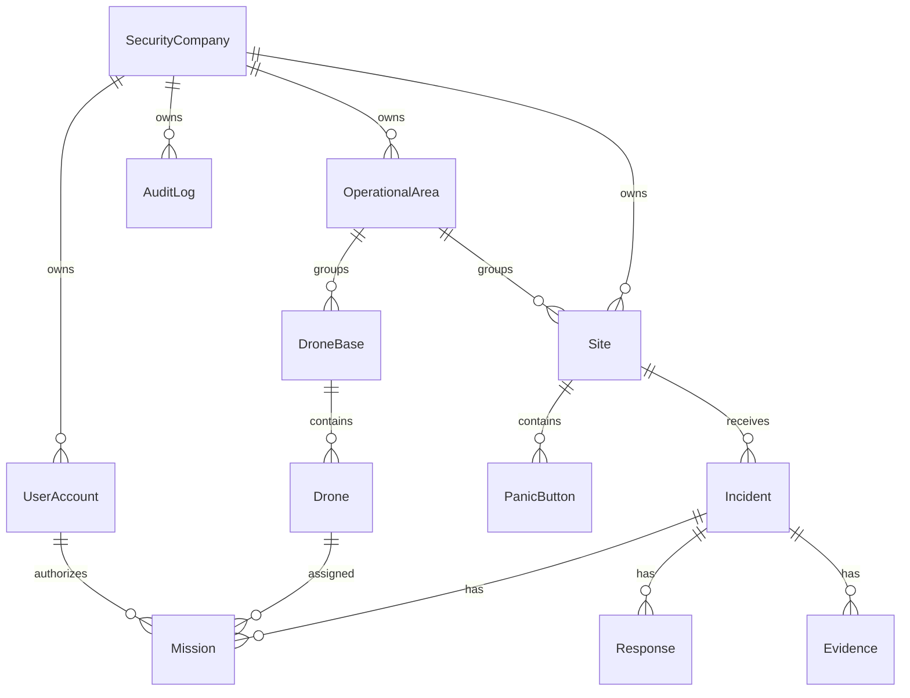

# Planned domain relationships — not implemented in Phase 1

This conceptual diagram preserves the agreed model; it is not a migration or a
complete foreign-key design. Response-team membership, base/site eligibility,
tenant constraints and audit actor links will be specified in their phases.
Phase 1 creates only Flyway schema history.
